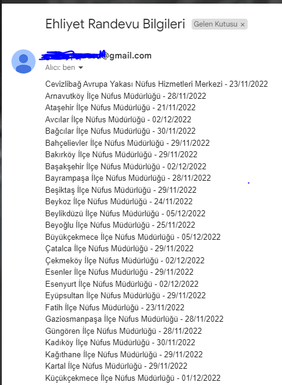

# Python Selenium ile E-Devlet Sürücü Belgesi Randevu Müsaitlik Durumuna Göre Otomatik Mail Gönderimi

**kod içerisindeki `value` değerini hangi `il` için kontrol yapıyorsanız o ilin `plaka kodu` ile değiştiriniz**

**randevu bulunduğunda gönderilen mail örneği:**

